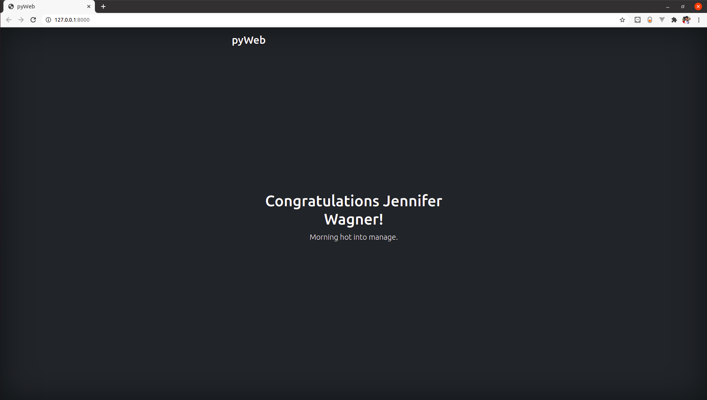
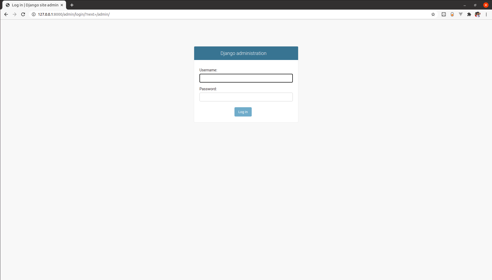

# Web - Peramal

## Deskripsi
Peramal merupakan soal yang membutuhkan _web service_. _Service_ dinyatakan berhasil dipasang apabila saat dilakukan kunjungan `http://<IP SERVER>:<MACHINE PORT>` memberi respon berikut:

Selain itu, kunjungan ke `http://<IP SERVER>:<MACHINE PORT>/admin` harus mengembalikan tampilan berikut:

## Spesifikasi Dockerfile
- Python: v3.8
- User: compfest15
- Container port: 1234
- Working directory: /opt/peramal
- Install semua modul python yang ada di `files/requirements.txt`
- Jalankan django project yang ada di `files/pyweb` dan gunakan container port sebagai listening port

## Spesifikasi docker-compose.yml
- Environment variabel `PRODUCTION` harus bernilai `true`.
- Compatible dengan docker engine versi 19 ke atas.
- Lakukan mapping port dari container ke host (server/komputer Anda) sesuai dengan machine port. Machine port adalah `2[4 digit terakhir NPM Anda]`, e.g. Misal NPM saya 1234567890, maka machine port saya adalah `27890`.
- Nama container gunakan `WEB_[NPM]` sebagai contoh `WEB_1234567890`.
- Lakukan setting agar container selalu melakukan restart.

## Referensi
- [Django](https://docs.djangoproject.com/en/3.1/intro/tutorial01/)
- [Pip](https://pip.pypa.io/en/stable/user_guide/)
- [Django Staticfiles](https://docs.djangoproject.com/en/3.1/ref/contrib/staticfiles/)
